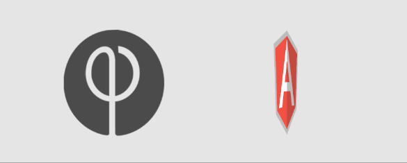

# angus

#### Next Gen integration of Famo.us Mixed Mode and Angular 2.

v0.0.1



Angus gives Angular 2 developers access to Famo.us DOMElement and Mesh inside of templates. This library allows engineers to bind Angular 2 properties to Famo.us Objects for fast, efficient templating.


```
    <fa-node [origin]="[0.5,0.5,0.0]"
             [align]="[0.25,0.25,0.0]"
             [sizeMode]="['absolute','absolute', 'absolute']"
             [absoluteSize]="[200,200,200]"
             [opacity]="0.25">
             <fa-element [properties]="{backgroundColor:'cyan', textAlign:'center', paddingTop: '40%'}"
                         [content]="'<h5>Hello World</h5>'">
             </fa-element>
    </fa-node>

    <fa-node [origin]="[0.5,0.5,0.0]"
             [align]="[0.6,0.6,0.0]"
             [sizeMode]="['absolute','absolute', 'absolute']"
             [absoluteSize]="[120,120,120]"
             [opacity]="0.75">
             <fa-mesh [geometry]="'Tetrahedron'"></fa-mesh>
    </fa-node>


```

* NOTE: Angus is still very early in development and is not ready for a Production environment.


###Angus Needs Your Help!

Angus needs the help of the Famo.us and Angular 2 Developer Communities to really take off and be an invaluable next-gen tool for Web Developers.

Angus still has a long way to go before it is ready for a Production environment. If you are interested in contributing to the project and helping to build out Angular 2 Components that interface with the Famo.us Engine, please contact steveblue at gmail dot com.


###Getting Started

Fork the repo and then clone it.

Angular 2 Components can either be written in ES5, ES6 or Typescript syntax. It seems like the Angular 2 Community has put full steam support behind Typescript since ng-conf so I have chosen to use it in development of Angus. Currently, LiveServer is used for development.

```
npm install -g typescript
npm install -g live-server

```

Eventually, a more sophisticated build operation and development environment will most likely replace the requirement for LiveServer.

In the project directory, run `npm install`.

###View the demo app

In the project directory, use the `live-server` command.


###Develop Angus

To watch for changes to typescript and compile on every save, run `tsc --watch` in the project directory.

* Commit changes to a branch, i.e. `feature/gl-textures` or `bug/broken-textures`.

* Push changes to remote fork.

* Make a pull request.


##What Angus Needs

* Support for WebGL Features
* Support for Famo.us Physics Engine
* Integration of Famo.us UI Events
* Typescript type definitions for Famo.us Mixed Mode
* Better handling and customization of Famo.us Engine
